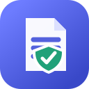

  

<h1 align="center">文栈 SnipNest</h1>

运行在 Microsoft Edge 本地的网页长文本保险箱。

文栈会在你明确授权的网站中保护正在编辑的文字：自动保存草稿、保留字段历史、发现疑似误删，并把值得长期使用的内容升级为可跨网站手动插入的永久片段。所有匹配和正文处理均在浏览器本地完成。

> 当前版本为 `v0.2.4`，通过 GitHub Release 手动安装。首次使用建议先在不重要的网页内容上熟悉恢复、删除和更新流程。

[下载最新版本](https://github.com/Kaktus981/snipnest/releases/latest) · [安装教程](#下载与安装) · [隐私说明](#数据与隐私) · [反馈问题](https://github.com/Kaktus981/snipnest/issues)

## 主要能力

- **自动保护草稿**：输入停止约 800 毫秒后保存最新内容，失焦或连续编辑 30 秒时建立历史检查点。
- **可控自动保存**：默认开启；关闭后停止普通输入的持续保存，但大段文字的误删保护仍然工作。
- **短文本也能保存**：默认从第 1 个非空字符开始保护；1 至 9 字内容会进入独立的“短草稿”区域，减少列表干扰。
- **字段级历史**：同一字段只保留一份最新草稿，并保存最近 5 个历史版本，内容没有变化时不会重复写入。
- **意外清空保护**：原内容至少 20 字且一次减少 80% 以上时，保存删除前快照，可恢复或忽略提醒。
- **草稿整理**：按网站、日期或字段分组，支持搜索、折叠、全选、批量延长 30 天和批量删除。
- **永久片段**：将临时草稿升级为带标题、分类和标签的永久片段，不再自动过期。
- **本地智能推荐**：根据字段标签、占位文字、字段名和页面标题进行本地评分，最多推荐 3 条相关片段。
- **逐站授权**：只有你主动选择保护的网站才会注入内容脚本；授权可随时暂停或撤销。
- **敏感字段过滤**：密码、验证码、支付、证件、文件上传和隐藏字段不会创建草稿。
- **本地数据控制**：支持 JSON 导入、导出和一键清除全部数据，不需要账号、云端服务或遥测。

## 字段兼容状态

| 页面内容 | 当前能力 | 状态 |
| --- | --- | --- |
| `textarea` | 保存、历史、恢复、片段推荐与插入 | 支持 |
| 普通长文本 `input` | 保存、历史、恢复、片段推荐与插入 | 支持 |
| 常见 `contenteditable` | 以纯文本保存和插入 | 支持，原富文本格式不保留 |
| 动态加载的 SPA 表单 | 聚焦后发现并保护字段 | 支持常见场景 |
| iframe 内表单 | 首版不读取 | 暂不支持 |
| 密码、验证码、支付、证件、文件字段 | 主动忽略 | 安全过滤 |

网页编辑器的实现方式各不相同。遇到无法识别的字段时，请在 Issue 中说明网站、页面类型和复现步骤，但不要上传真实文稿或个人信息。

## 使用教程

### 1. 开始前准备

使用文栈需要：

- Microsoft Edge 114 或更高版本。
- 一个用于长期保存扩展文件的固定文件夹。
- 普通的 `http` 或 `https` 网页；浏览器内部页面和 Edge 扩展商店页面不能被扩展读取。

### 2. 下载与安装

1. 打开项目的 [Releases 页面](https://github.com/Kaktus981/snipnest/releases/latest)。
2. 下载名为 `SnipNest-<版本号>-edge.zip` 的附件，不要下载 GitHub 自动生成的 Source code 压缩包。
3. 右键 ZIP，选择“全部解压”，放到一个不会被移动或删除的固定目录。
4. 在 Edge 地址栏输入 `edge://extensions` 并按回车。
5. 打开左侧或页面上的“开发人员模式”。
6. 点击“加载解压缩的扩展”，选择刚才解压的目录。正确目录中应直接包含 `manifest.json`。
7. 在扩展列表中找到“文栈 SnipNest”，确认开关已经开启。
8. 点击 Edge 工具栏上的扩展按钮，将“文栈 SnipNest”固定到工具栏。

安装后不要移动或删除解压目录，否则 Edge 无法继续加载扩展，也可能导致扩展身份变化，进而无法访问原来的本地数据。

### 3. 第一次保护网站

1. 打开准备编辑内容的普通网页。
2. 点击工具栏中的“文栈 SnipNest”图标。
3. 点击“保护并打开文栈”。
4. Edge 首次显示网站权限提示时，点击“允许”。
5. 侧边栏会同步打开，当前网站应显示为已保护。
6. 点击页面中的长文本字段并开始输入；字段附近会出现“文”字入口，侧边栏也会显示当前字段状态。

如果文栈侧边栏已经打开，也可以直接在“当前页面”中点击“保护此网站”，无需回到浏览器工具栏。Edge 显示网站权限提示后点击“允许”即可。

授权按网站来源分别保存。例如授权 `https://example.com` 不代表扩展可以读取其他网站。你可以在弹窗中暂停保护或撤销该网站授权。

### 4. 找回草稿与历史

- 打开侧边栏的“当前页面”查看当前字段可恢复的内容。
- 在“草稿”页搜索全部临时草稿，并按网站、日期或字段分组。
- 打开某条草稿可查看最近的字段历史；确认内容后再手动恢复，文栈不会静默覆盖当前输入。
- 1 至 9 字草稿默认折叠在“短草稿”区域，需要时再展开。
- 临时草稿默认保留 7 天，可手动延长为 30 天或升级为永久片段。

### 5. 处理疑似误删

当大段内容被一次清空或大幅缩短时，文栈会保留最近一次删除前快照：

1. 点击页面旁的“文”字入口，或打开侧边栏中的对应草稿。
2. 预览删除前内容。
3. 选择“恢复删除前内容”，或在确认是主动修改后选择“忽略提醒”。

逐字正常删除、原内容不足 20 字以及敏感字段不会触发此提醒。完全清空字段时，空内容不会覆盖原草稿。

### 6. 创建和使用永久片段

1. 在草稿详情中选择“升级为片段”。
2. 填写标题，并可添加分类和标签。
3. 在另一个已授权网站聚焦相关字段。
4. 打开“文”字入口或侧边栏查看本地推荐。
5. 预览并确认后手动插入；文栈不会自动提交表单。

片段推荐只使用字段和页面提供的本地文本线索，不调用 AI，也不会上传片段正文。

### 7. 整理、导入、导出与清除数据

- 在“草稿”页切换按网站、日期或字段分组；选择会保存在本机，下次打开仍然沿用。
- 每个分组可折叠、全选、批量延长或批量删除。批量删除不可撤销，请先确认数量。
- 在“隐私与设置”中导出本地 JSON，作为人工备份。
- 在“隐私与设置”中选择“导入 JSON”，可以合并旧版本文栈导出的草稿、片段和兼容设置；同ID数据只在备份版本更新时覆盖。
- “清除全部数据”会删除全部草稿和片段，操作不可撤销；网站授权可在“已授权网站”中单独撤销。

导入和导出都只在当前浏览器本地处理。JSON 包含文稿正文，请保存到可信位置，不要上传到公开 Issue 或公共网盘。

### 8. 更新扩展

使用解压安装方式更新时：

1. 如有重要文稿，先在“隐私与设置”中导出 JSON 备份。
2. 下载新版本 ZIP。
3. 将新文件解压并覆盖原来的固定扩展目录。
4. 打开 `edge://extensions`。
5. 在“文栈 SnipNest”卡片上点击“重新加载”。

尽量沿用同一个解压目录，不要先删除旧扩展再从另一个路径加载。重新加载后，已存在的草稿、片段、授权和设置应继续保留。

### 9. 删除数据或卸载

- 只想删除文稿：在侧边栏删除单条、批量删除，或使用“清除全部数据”。
- 只想停止某个网站：在工具栏弹窗中暂停或撤销该网站授权。
- 完全卸载：打开 `edge://extensions`，在“文栈 SnipNest”卡片中点击“删除”。

卸载扩展通常会同时删除其浏览器本地数据。卸载前请先导出需要保留的内容。

### 10. 常见问题

#### 点击保护后，侧边栏仍显示未保护

确认 Edge 权限提示中已经点击“允许”。然后关闭扩展弹窗，重新聚焦网页字段；如页面在安装扩展前已经打开，可刷新一次页面。

#### 输入后没有产生草稿

确认当前网站已授权、保护没有暂停，并等待约 800 毫秒。密码、验证码、支付、证件、文件上传、隐藏字段和 iframe 内字段不会保存；纯空白内容也不会建立草稿。

#### 页面没有出现“文”字入口

先点击可编辑的长文本字段。部分复杂富文本编辑器或 iframe 无法在当前版本识别，此时仍可在侧边栏查看已有草稿和片段。

#### 为什么短草稿不在主要列表中

1 至 9 字草稿会保存在默认折叠的“短草稿”区域，它们仍遵循相同的 7 天保留期，不会因为较短而提前删除。

#### 为什么恢复后网页没有响应

文栈会使用原生输入方式并触发 `input` 和 `change` 事件，兼容常见 React/Vue 表单。少数自定义编辑器可能采用特殊状态管理，请提交不包含真实文稿的复现步骤。

## 数据与隐私

- 草稿和片段正文保存在扩展自身的 IndexedDB 中。
- 设置和逐站授权状态保存在 `chrome.storage.local` 中。
- 当前版本没有账号、同步服务器、广告、统计、遥测或正文网络上传功能。
- 公开安装包不包含发布者的个人草稿；每位用户的数据只存在于自己的 Edge 配置中。
- 临时草稿默认 7 天后由后台定时清理，永久片段只有用户主动删除时才移除。
- 本地存储并不等于加密保险库，无法抵御已经取得本机、Edge 配置目录或系统权限的恶意程序。
- 请勿在公开 Issue 中粘贴文稿、导出 JSON、联系方式、证件信息或其他隐私内容。

## 浏览器权限

| 权限 | 用途 |
| --- | --- |
| `storage` | 保存设置、逐站授权状态和本地数据配置 |
| `sidePanel` | 显示“当前页面、草稿、片段、隐私与设置”工作区 |
| `scripting` | 只在已授权网站动态注册或移除内容脚本 |
| `alarms` | 每日清理已过期的临时草稿 |
| `activeTab` | 在用户操作扩展时识别当前标签页和网站 |
| 可选网站权限 | 仅在用户确认后访问对应的 `http` 或 `https` 网站来源 |

文栈不会在安装时默认获得所有网站内容权限。撤销某个网站的授权后，扩展会停止监听并注销该网站的内容脚本。

## 使用边界

- 文栈是本地草稿保护工具，不是密码管理器或抵御本机入侵的加密保险库。
- 当前版本只保存和插入纯文本，不保留富文本样式。
- 恢复和片段插入均需要用户确认，不会自动提交网页表单。
- 网站可能调整页面结构，特殊编辑器的兼容性需要持续适配。
- 请遵守网站服务条款和适用法律，不要用片段功能发送垃圾信息或未经确认的内容。

## 许可

本项目目前尚未添加开源许可证。在许可证正式加入前，源码版权默认保留；公开可见不等同于授权复制、修改或再分发。

## 免责声明

本项目按现状提供，不作任何明示或默示保证。重要文稿请保留独立备份，使用者应自行承担浏览器故障、误操作、扩展兼容性和本机安全环境带来的风险。
